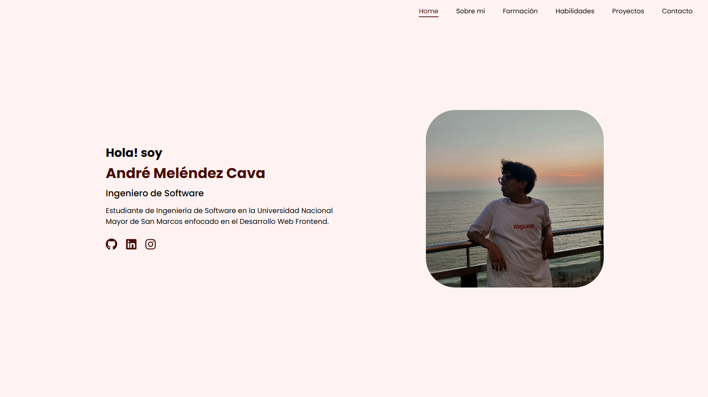

# 📁 Portafolio Personal — André Meléndez Cava

Este proyecto es mi portafolio personal como estudiante de Ingeniería de Software, donde presento mis habilidades, tecnologías que domino y proyectos destacados.

---

## 🛠️ Tecnologías Utilizadas

<p align="left">
  
  
  
  
  
</p>

---

## 📸 Vista previa

 <!-- Puedes cambiar esto por una imagen real de tu proyecto -->

---

## 📄 Demo

Puedes ver el portafolio desplegado en:  
🔗 [https://tusitio.com](https://portafolio-seven-wheat.vercel.app/)

---

## 📦 Instalación local

```bash
git clone https://github.com/tuusuario/portafolio.git
cd portafolio
npm install
npm run dev
